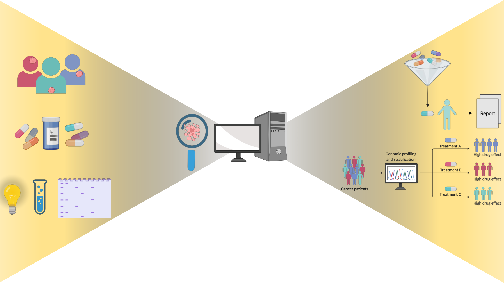

# PREDICT-AML: Personalized Drug Response Prediction for AML Patients



## Description

PREDICT-AML is a machine learning framework for personalized drug response prediction in Acute Myeloid Leukemia (AML). It integrates multi-omics patient features (gene expression, mutation profiles, cell-type enrichments, pathway enrichments) with four complementary drug representations to predict patient-specific drug sensitivity (AUC/DSS).

The best-performing architecture is **TabPFN** (tabular foundation model) combined with **KD-Embed** (knowledge-distilled SMILES autoencoder) drug representations, validated on three independent cohorts.

| Cohort | Role | Patients | Drugs |
|---|---|---|---|
| BeatAML Waves 1+2 | Training | 337 | 165 |
| BeatAML Waves 3+4 | Test | 183 | 150 |
| LeeAML | External validation | 30 | 49 (BeatAML-overlapping) |
| FIMM-AML | External validation | 187 | 78 (BeatAML-overlapping) |

---

## Directory Structure

```
PT-AML2.0/
├── Data/                              # Processed feature matrices and drug embeddings
│   ├── FIMM-AML/                      # FIMM-AML dataset files
│   ├── leeaml/                        # LeeAML dataset files
│   └── SMILES_Autoencoder/            # SMILES autoencoder training data
├── Docs/                              # Project documentation and publications
├── Models/                            # Trained model artefacts
│   ├── catboost_models/
│   ├── cnn_models/
│   ├── gat_models/
│   ├── gcn_models/
│   ├── glr_models/
│   ├── lgbm_models/
│   ├── lstm_models/
│   ├── rf_models/
│   ├── tabpfn_models/
│   └── xgb_models/
├── Results/                           # All results artefacts
│   ├── catboost/ cnn/ gat/ gcn/       # Per-model CV and test results
│   ├── glr/ lgbm/ lstm/ rf/ svr/ xgb/
│   ├── tabpfn/                        # TabPFN BeatAML results + best-model analysis
│   │   └── best_model_analysis/       # Predictions, CI, SHAP, waterfall plots
│   ├── tabpfn_fimmaml/                # TabPFN FIMM-AML validation results
│   ├── tabpfn_leeaml/                 # TabPFN LeeAML validation results
│   ├── Figures/                       # Publication-ready figures
│   ├── Tables/                        # Summary Excel tables (all comparisons, ablation)
│   ├── PreProcess/                    # Intermediate preprocessing artefacts
│   └── MDREAM/                        # MDREAM baseline comparison
├── scripts/                           # All analysis, preprocessing, and training scripts
├── npj_PO/                            # Manuscript (npj Precision Oncology submission)
├── environment.yml                    # Conda/micromamba environment specification
└── README.md
```

---

## Environment Setup

```bash
# Recommended: micromamba
micromamba env create -f environment.yml
micromamba activate BeatAML2.0

# Or with conda
conda env create -f environment.yml
conda activate BeatAML2.0
```

> **Note:** The primary environment name is `BeatAML2.0`. All SLURM scripts activate this environment. The SHAP analysis additionally requires `tabpfn>=8.0.2` and `shapiq`.

---

## Objectives

1. Build predictive models of patient-specific drug response from multi-omics profiles.
2. Identify the optimal drug for a patient given their genomic and transcriptomic state.
3. Characterise inter-patient heterogeneity in predicted drug sensitivity across cohorts.
4. Provide post-hoc SHAP explanations at both population and individual-sample levels.

---

## Pipeline Overview

### 1. Pre-processing

| Script | Description |
|---|---|
| `analyze_patient_rnaseq.R` | BeatAML gene expression QC; t-SNE; merges pathway, cell-type, and module enrichments; outputs train/test feature matrices |
| `analyze_patient_dnaseq.R` | BeatAML whole-exome sequencing; outputs sample × mutation-type matrices |
| `analyze_patient_drug_combinations.R` | Combines RNAseq + mutation profiles; STRING PPI random-walk diffusion; AUCell pathway–drug proximity scores; final train/test feature sets |
| `analyze_leeaml_rnaseq.R` | LeeAML gene expression processing |
| `analyze_leeaml_drug_combinations.R` | LeeAML drug–patient feature matrix construction |
| `analyze_fimmaml_sequence_data.R` | FIMM-AML sequencing data processing |
| `analyze_fimmaml_drug_combinations.R` | FIMM-AML drug–patient feature matrix construction |
| `preprocess_patients.py` | Cleans patient features; builds train/test pickle datasets |
| `preprocess_beataml_drugs.py` | BeatAML drug metadata (PubChem CIDs, SMILES, MolWeight, XLogP) |
| `preprocess_leeaml_drugs.py` | Same pipeline for LeeAML drugs |
| `preprocess_fimmaml_drugs.py` | Same pipeline for FIMM-AML drugs |
| `combined_drug_patient_info.py` | Merges drug representations with BeatAML patient features → unified PKL files |
| `combined_drug_patient_info_leeaml.py` | Same merge for LeeAML patients |
| `combined_drug_patient_info_fimmaml.py` | Same merge for FIMM-AML patients |
| `EDA_plots.R` | Exploratory data analysis and visualisation |
| `all_patients_functions.R` | Shared R utility functions |
| `inhibitor_analysis.py` | Inhibitor compound property analysis |

### 2. Drug Representations

| Script | Description |
|---|---|
| `morgan_fps.py` | Morgan fingerprints (radius 2, 2048 bits) |
| `ls_generator2.py` | KD-Embed: encodes SMILES to 253-dim vectors via SMILES LSTM autoencoder |
| `seq2seq.py` | Sequence-to-sequence SMILES autoencoder architecture |
| `tokeniser.py` | Tokenisation utilities for SMILES and sequence models |

Four drug representations are used throughout: **PC** (physicochemical descriptors), **KD-Embed** (knowledge-distilled LSTM autoencoder, 253-dim), **ChemBERTa** (chemical language model), **MolFormer** (molecular transformer).

### 3. Machine Learning Models

| Script | Runner | Description |
|---|---|---|
| `glr_model.py` | — | Generalised linear regression |
| `neosvr_model.py` | — | Extended SVR variant |
| `LSSVM_implementation.py` | — | Least-squares SVM |
| `rf_model.py` | — | Random forest with Optuna hyperparameter tuning |
| `xgboost_model.py` | — | XGBoost with Optuna tuning |
| `lightgbm_model_refactored.py` | — | LightGBM with Optuna tuning |
| `catboost_model_refactored.py` | `run_catboost.sh` | CatBoost with Optuna tuning |
| `tabpfn_model.py` | — | TabPFN (tabular foundation model; **best overall model**) |

### 4. Deep Learning Models (GPU)

| Script | Runner | Description |
|---|---|---|
| `cnn_model.py` | `run_cnn.sh` | 1D-CNN over SMILES tokens + patient FFNN |
| `lstm_model.py` | `run_lstm.sh` | LSTM over SMILES tokens + patient FFNN |
| `gat_model_optuna.py` | `run_gat.sh` | Graph Attention Network (molecular graph) |
| `gcn_model_optuna.py` | `run_gcn.sh` | Graph Convolutional Network (molecular graph) |
| `dl_model_architecture.py` | — | Shared DL layer definitions |
| `dl_model_evaluations.py` | — | DL model evaluation utilities |

### 5. External Validation

| Script | Runner | Description |
|---|---|---|
| `tabpfn_leeaml_model.py` | `run_tabpfn_leeaml.sh` | TabPFN validation on LeeAML (49 overlapping drugs) |
| `tabpfn_fimmaml_model.py` | `run_tabpfn_fimmaml.sh` | TabPFN validation on FIMM-AML (78 overlapping drugs, all 4 drug representations) |
| `plot_leeaml_predictions.py` | — | Predicted vs. observed scatter plots for LeeAML |
| `plot_fimmaml_predictions.py` | — | Predicted vs. observed scatter plots for FIMM-AML |
| `plot_unseen_drug_predictions.py` | — | Scatter plots for drugs not seen during training |

### 6. Evaluation & Cross-Validation

| Script | Runner | Description |
|---|---|---|
| `cv_evaluation.py` | `run_cv.sh` | 5-fold CV metrics for all ML models |
| `cv_tabpfn_evaluation.py` | `run_cv_ablation.sh` | TabPFN-specific CV evaluation |
| `dl_cv_metrics.py` | `run_dl_cv_metrics_cnn.sh` / `_gat.sh` / `_gcn.sh` / `_lstm.sh` | CV metrics for DL models |
| `dl_test_cv_metrics.py` | `run_dl_test_cv_metrics.sh` | Test-set metrics for DL models |
| `misc.py` | — | Shared utility functions |

### 7. Ablation Studies

| Script | Runner | Description |
|---|---|---|
| `tabpfn_ablation_study.py` | `run_tabpfn_4group.sh` | Full feature-group ablation for TabPFN |
| `tabpfn_ablation_1group.py` | `run_tabpfn_1group.sh` | Single-group feature subsets |
| `tabpfn_ablation_2group.py` | `run_tabpfn_2group.sh` | Pairwise feature-group combinations |
| `tabpfn_ablation_3group.py` | `run_tabpfn_3group.sh` | Triple feature-group combinations |
| `tabpfn_ablation_summary.py` | — | Summarises all ablation results |

Feature groups: (i) Gene Expression, (ii) Mutation profiles, (iii) Pathway enrichment, (iv) Clinical/CellType/Module enrichment.

### 8. Best-Model Analysis Pipeline (two-step)

This two-step pipeline performs in-depth analysis of the best TabPFN (KD-Embed) model. Steps 1–4 must complete before Step 5–6.

#### Step 1–4 — Predictions, CI, Embedding Importance

| Script | Runner | GPU time |
|---|---|---|
| `tabpfn_predict_embed.py` | `run_tabpfn_predict_embed.sh` | ~2 h, 1× H200 |

Outputs to `Results/tabpfn/best_model_analysis/`:

| Output | Description |
|---|---|
| `feature_subset.csv` | Top 128 features by MinMax-scaled variance |
| `test_predictions_with_CI.csv` | Per-sample predictions with 95% CI |
| `predictions_scatter.pdf` | Predicted vs. observed scatter |
| `CI_width_distribution.pdf` | Distribution of CI widths |
| `embedding_attention_importance.csv` | Embedding-proxy feature importance |
| `embedding_importance_bar_{train,test}.pdf` | Importance bar charts |

#### Step 5–6 — SHAP via shapiq (crash-safe, resumable)

| Script | Runner | GPU time |
|---|---|---|
| `tabpfn_shap_v2.py` | `run_tabpfn_shap_v2.sh` | ~5.5–9 h per batch (4–10 samples) |

**Method:** Retrains a fresh `TabPFNRegressor` (tabpfn ≥ 8.0.2, n_estimators=8) on the top 128 MinMax-variance features, then computes SHAP values using `TabPFNExplainer` with `PermutationSamplingSV` (budget=4096, 4 orderings). Uses a stratified subsample of 10,000 training rows as explainer context. Crash-safe two-level checkpoint cache allows resuming from the deepest completed sample.

Outputs to `Results/tabpfn/best_model_analysis/`:

| Output | Description |
|---|---|
| `shap_v4_beeswarm_test.pdf` | SHAP beeswarm — top 30 features, all test pairs |
| `shap_v4_single_sample_idx{N}.pdf` | SHAP waterfall for individual test sample N |
| `shap_v4_single_sample_idx{N}.csv` | Per-feature SHAP values for sample N |
| `shap_v4_combined_importance.pdf` | SHAP + embedding-attention combined importance |

> **Timing note:** Each SHAP sample takes ~3–8 s/coalition × 4096 budget ≈ 3.4–9 h on one H200. Re-submit `run_tabpfn_shap_v2.sh` sequentially — each run resumes automatically from the last checkpoint and explains the next batch of samples.

### 9. Visualisation

| Script | Description |
|---|---|
| `drug_patient_heatmap.R` | Hierarchical drug × patient AUC heatmap for BeatAML |
| `drug_patient_heatmap_external_cohorts.R` | Drug × patient heatmaps for LeeAML and FIMM-AML |
| `multiomics_heatmap.R` | Colorblind-safe multi-omics annotation heatmap (manuscript-ready) |
| `top10_drug_feature_correlation_heatmap.R` | Correlation heatmaps between top-10 drugs (by Pearson r) and feature subsets |
| `tabpfn_drug_histogram_lognormal.py` | Per-drug predicted AUC histograms with Shapiro-Wilk log-normality testing |

---

## Key Data Files

| File | Description |
|---|---|
| `Data/Training_Set_Var_Mod.pkl` | Training set (variance-filtered, modular features) |
| `Data/Test_Set_Var_Mod.pkl` | Test set |
| `Data/Test_Set_Var_with_Drug_Embedding_Patient_Info.pkl` | Test set with KD-Embed drug features |
| `Data/Test_Set_Var_with_Drug_ChemBERTa_Patient_Info.pkl` | Test set with ChemBERTa drug features |
| `Data/Test_Set_Var_with_Drug_MolFormer_Patient_Info.pkl` | Test set with MolFormer drug features |
| `Data/Test_Set_Var_with_Drug_Only_PC_Patient_Info.pkl` | Test set with physicochemical drug features |
| `Data/Drug_Full_SMILES_Embedding.csv` | KD-Embed drug embeddings (253-dim) |
| `Data/Drug_Full_ChemBERTa_Embedding.csv` | ChemBERTa drug embeddings |
| `Data/Drug_Full_MolFormer_Embedding.csv` | MolFormer drug embeddings |
| `Data/Drug_Full_Info.csv` | Drug metadata (PubChem CIDs, SMILES, MW, XLogP) |
| `Data/ablation_feature_columns.csv` | Feature column definitions for ablation study |
| `Data/Feature_Mapping_LS_Feat_Var.tsv` | Feature index mapping for KD-Embed |
| `Data/Feature_Mapping_MFP_Feat_Var.tsv` | Feature index mapping for Morgan fingerprints |
| `Data/String_PPI_Cutoff_0.7.csv` | STRING PPI network (confidence ≥ 0.7) |
| `Data/leeaml/` | LeeAML processed feature files |
| `Data/FIMM-AML/` | FIMM-AML processed feature files |
| `Data/SMILES_Autoencoder/` | SMILES autoencoder training data |
| `Results/Tables/Predict-AML2.0.xlsx` | Full results table (all model comparisons, ablation, CV) |

---

## HPC Job Submission (SLURM)

All shell scripts use SLURM and `micromamba activate BeatAML2.0`. GPU jobs use the `gpu-H200` partition.

### Recommended execution order

```bash
# 1. Pre-process (run once)
Rscript scripts/analyze_patient_rnaseq.R
Rscript scripts/analyze_patient_dnaseq.R
Rscript scripts/analyze_patient_drug_combinations.R
python3 scripts/preprocess_patients.py
python3 scripts/combined_drug_patient_info.py

# 2. Train all models
python3 scripts/tabpfn_model.py          # Best model
sbatch scripts/run_catboost.sh
sbatch scripts/run_cnn.sh                # GPU
sbatch scripts/run_lstm.sh               # GPU
sbatch scripts/run_gat.sh                # GPU
sbatch scripts/run_gcn.sh                # GPU

# 3. Cross-validation evaluation
sbatch scripts/run_cv.sh                 # All ML models (cv_evaluation.py)
sbatch scripts/run_cv_ablation.sh        # TabPFN CV (cv_tabpfn_evaluation.py)
sbatch scripts/run_dl_cv_metrics_cnn.sh
sbatch scripts/run_dl_cv_metrics_lstm.sh
sbatch scripts/run_dl_cv_metrics_gat.sh
sbatch scripts/run_dl_cv_metrics_gcn.sh

# 4. Ablation study
sbatch scripts/run_tabpfn_1group.sh
sbatch scripts/run_tabpfn_2group.sh
sbatch scripts/run_tabpfn_3group.sh
sbatch scripts/run_tabpfn_4group.sh      # Full ablation (tabpfn_ablation_study.py)
python3 scripts/tabpfn_ablation_summary.py

# 5. External validation
sbatch scripts/run_tabpfn_leeaml.sh
sbatch scripts/run_tabpfn_fimmaml.sh     # All 4 drug representations in one run

# 6. Best-model analysis (must run in order)
sbatch scripts/run_tabpfn_predict_embed.sh   # Steps 1–4: ~2 h
sbatch scripts/run_tabpfn_shap_v2.sh         # Steps 5–6: ~5.5–9 h per batch
# Re-submit run_tabpfn_shap_v2.sh as needed — each run resumes automatically
```

### GPU resource requirements

| Job | Partition | GPUs | RAM | Est. time |
|---|---|---|---|---|
| `run_cnn.sh` / `run_lstm.sh` | `gpu-H200` | 1× H200 | 120 GB | ~4–8 h |
| `run_gat.sh` / `run_gcn.sh` | `gpu-H200` | 1× H200 | 120 GB | ~6–12 h |
| `run_tabpfn_fimmaml.sh` | `gpu-H200` | 1× H200 | 120 GB | ~3 h |
| `run_tabpfn_predict_embed.sh` | `gpu-H200` | 1× H200 | 120 GB | ~2 h |
| `run_tabpfn_shap_v2.sh` | `gpu-H200` | 1× H200 | 120 GB | ~5.5–9 h/batch |

---

## Citation

If you use PREDICT-AML, please cite:

> Al-Ani M, Jani SP, Bensmail H, Mall R. *PREDICT-AML: Personalized REsponse via Drug Interaction with Cellular Traits for Acute Myeloid Leukemia*. npj Precision Oncology (under review, 2026).
